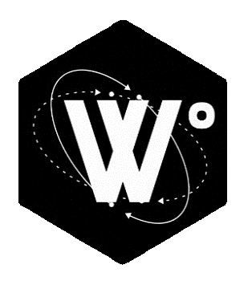
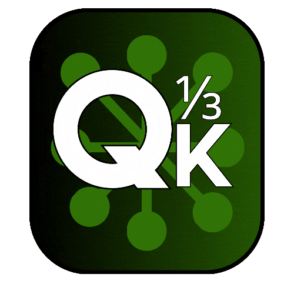

## 🧑🏼‍🚀 You're on my space.

Welcome to my GitHub profile! I'm Arthur Itajahy, a tech enthusiast and leader with advanced skills in Java, C, C++ Kotlin, AWS, Next.js, React.js, MongoDB, and Fluent in English. I am passionate about rockets, the universe, and everything in between. As a fan of space exploration and Kerbal Space Program (KSP), I love diving into the science and engineering that make interstellar travel possible. My technical background allows me to explore and build innovative solutions while continuing to fuel my fascination with space.
## 💻 Tech Stacks:
<!-- Badges from https://github.com/Ileriayo/markdown-badges -->
 

---
.

## Here Are Some Projects:

### Pro-Languages :
<table style="width: 100%; border: 1px solid #ddd; border-collapse: collapse;">
    <tr>
    <td style="padding: 10px; text-align: center;">
      
    </td>
    <td style="padding: 10px; text-align: left;">
      

        <strong>W° - A Robust Oriented Object Programming language - [IN DEVELOPMENT]</strong>
      

    </td>
      <td style="padding: 10px; text-align: center;">
      
    </td>
  </tr>
  <tr>
    <td style="padding: 10px; text-align: center;">
      
    </td>
    <td style="padding: 10px; text-align: left;">
      <pstyle="text-decoration: none; color: black;">
        <strong>Quark - A simple Oriented Object Programming language - [IN DEVELOPMENT]</strong>
      

    </td>
    <td style="padding: 10px; text-align: center;">
      
    </td>
  </tr>
</table>

### Simple Projects:

<table style="width: 100%; border: 1px solid #ddd; border-collapse: collapse;">
    <tr>
    <td style="padding: 10px; text-align: center;">
      
    </td>
    <td style="padding: 10px; text-align: left;">
      

        <strong>GÊNIO INDOMÁVEL - A Full stack project that I made for a conclusion of a bootcamp. [No longer in production]</strong>
      

    </td>
      <td style="padding: 10px; text-align: center;">
      
    </td>
  </tr>
    <tr>
    <td style="padding: 10px; text-align: center;">
      
    </td>
    <td style="padding: 10px; text-align: left;">
      

        <strong> KSP SCRIPTS - [IN DEVELOPMENT] </strong>
      

    </td>
      <td style="padding: 10px; text-align: center;">
      
    </td>
  </tr>
  <tr>
    <td style="padding: 10px; text-align: center;">
      
    </td>
    <td style="padding: 10px; text-align: left;">
      

        <strong>LOTR MEMORIAL - A website made to show my gratitude to the great Professor Tolkien</strong>
      

    </td>
     <td style="padding: 10px; text-align: center;">
      
    </td>
  </tr>
   <tr>
    <td style="padding: 10px; text-align: center;">
      
    </td>
    <td style="padding: 10px; text-align: left; ">
      

        <strong> Java University - It was made in group to consolidate the knowledge about OOP </strong>
      

    </td>
      <td style="padding: 10px; text-align: center;">
      
    </td>
  </tr>
  <tr>
    <td style="padding: 10px; text-align: center;">
      
    </td>
    <td style="padding: 10px; text-align: left;">
      

        <strong> BotLinkedin - Make request for friendship on linkedin and send them a message</strong>
      

    </td>
      <td style="padding: 10px; text-align: center;">
      
    </td>
  </tr>
</table>
