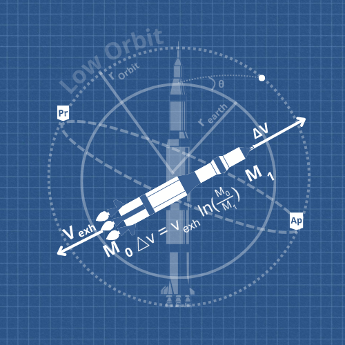

## 🧑🏼‍🚀 Hello, I'm on the space.

Welcome to my GitHub profile! I am passionate about rockets, the universe, and everything in between. As a fan of space exploration and Kerbal Space Program (KSP), I love diving into the science and engineering that make interstellar travel possible.

## The Tsiolkovsky Rocket Equation

At the heart of rocket science is the Tsiolkovsky Rocket Equation, which elegantly describes the relationship between a spacecraft's velocity change (Δv), exhaust velocity (ᵆ5), and the initial and final mass of the rocket:

This equation is a cornerstone of spaceflight, guiding mission planning and spacecraft design.

---

## About Me

- **Interests:** Orbital mechanics, delta-v optimization, and trajectory plotting.
- **Hobbies:** Exploring KSP with mods like Realism Overhaul and designing realistic spacecraft.
- **Goals:** To contribute to projects that push the boundaries of space exploration and education.

Feel free to explore my repositories and join me in my journey through the cosmos!
